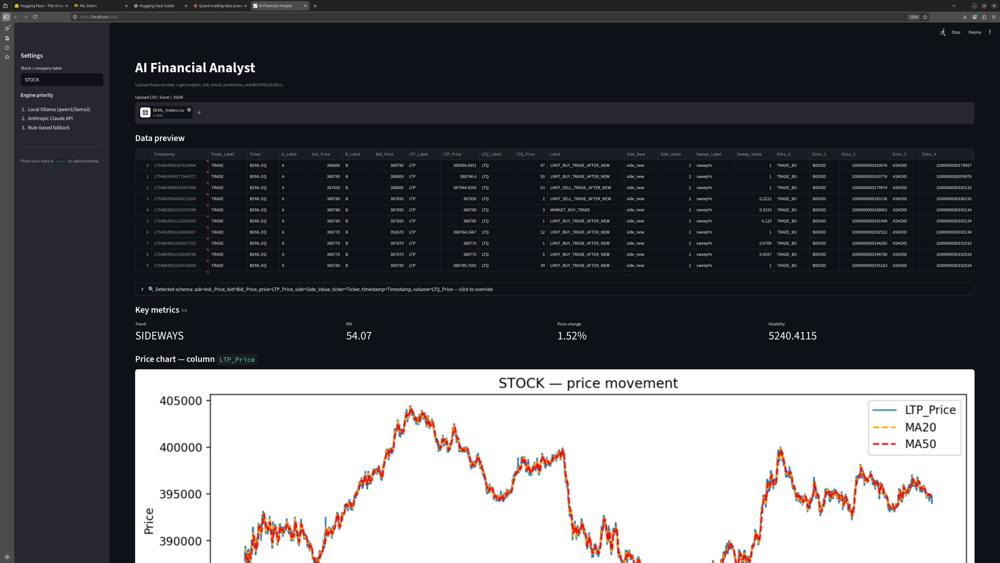
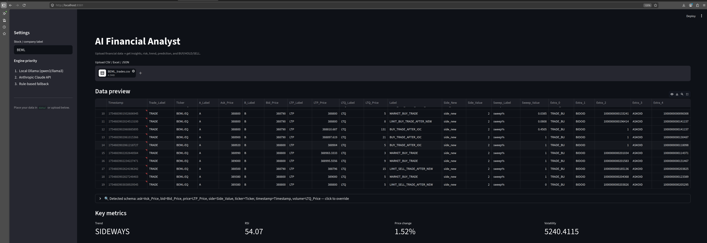
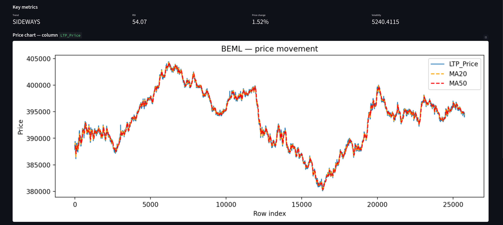
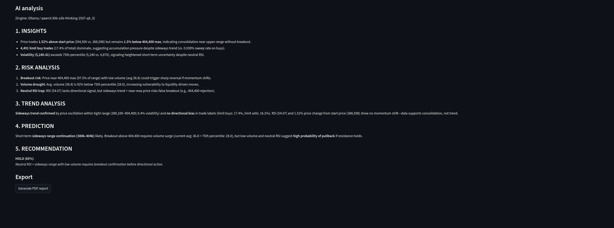

# 📈 ai-financial-analyst

> Streamlit dashboard for AI-augmented financial data analysis. Combines traditional quantitative analytics with LLM-generated narrative insights to surface risk concentrations, trend signals, and trading anomalies — all running on local infrastructure.


## What it does

Upload financial data (broker statements, P&L reports, market data CSVs) and get a structured analytical breakdown alongside LLM-generated commentary. The system auto-detects column roles using a synonym table with LLM fallback, computes a panel of quantitative metrics, generates an AI analysis narrative, and surfaces them in a clean Streamlit dashboard.

The LLM layer cascades through three engines: **local Ollama → Anthropic Claude API → rule-based fallback** — so it works regardless of whether you have GPU, API keys, or cloud access.

## Demo

### Main dashboard



*Upload financial CSV, auto-detect schema, instant key-metric surfacing and price visualization.*

### Schema auto-detection



*Detected schema from raw CSV (bid/ask, LTP, CTP, volume, timestamps, trade direction) with manual override capability.*

### Price chart with technical overlays



*Price movement with MA20 and MA50 overlay — example shown on BEML.*

### AI analysis output



*Structured AI report covering Insights, Risk Analysis, Trend Analysis, Prediction, and Recommendation — generated by local LLM with rule-based fallback.*

## Features

- 🔍 **Auto-detected schema** — column roles inferred via synonym table + LLM fallback (handles bid/ask/LTP/CTP/volume variations across brokers)
- 📊 **Quantitative metrics** — trend classification, RSI, price change, volatility
- 📈 **Technical overlays** — moving averages (MA20, MA50), price chart with row-indexed plotting
- 🤖 **AI commentary layer** — multi-engine LLM cascade for narrative analysis:
  - **Primary:** Local Ollama (offline, no cost)
  - **Secondary:** Anthropic Claude API (when configured)
  - **Fallback:** Rule-based templates (always works)
- ⚠️ **Risk assessment** — surface key risks based on volatility and trend signals
- 💡 **Recommendation engine** — actionable insights synthesized across quantitative and AI layers
- 📁 **Multi-format input** — CSV with flexible schema

## Quick start

```bash
git clone https://github.com/manavmishra-cloud/ai-financial-analyst.git
cd ai-financial-analyst
pip install -r requirements.txt

# Pull the LLM model (or skip — Anthropic / rule-based fallback works without)
ollama pull llama3.2:3b

# Run the dashboard
streamlit run app.py
```

Open the URL Streamlit gives you (typically `http://localhost:8501`), upload your CSV, choose engine priority in settings, and explore.

## Engine priority

The LLM layer has built-in fallback. Configure in the sidebar:

1. **Local (Ollama/llama3)** — preferred when available, no API costs
2. **Anthropic Claude API** — high-quality fallback when local unavailable
3. **Rule-based** — always-works baseline using heuristic templates

## Tech stack

- **Language:** Python 3.10+
- **UI:** Streamlit
- **Data:** pandas, numpy
- **LLM:** Ollama (local) + Anthropic API
- **Visualization:** Matplotlib

## Roadmap

- [ ] Multi-account portfolio aggregation
- [ ] Real-time data integration via broker APIs (Zerodha Kite, Upstox)
- [ ] Persistent analysis history with snapshot comparison
- [ ] Export to PDF / Excel reports
- [ ] Multi-asset class support (equities, options, futures, crypto)
- [ ] Backtesting integration with signal generators

## License

MIT — see [LICENSE](LICENSE)

## Contact

Manav Mishra · [LinkedIn](https://linkedin.com/in/manav-mishra-23a26b308) · manavmishra260205@gmail.com
